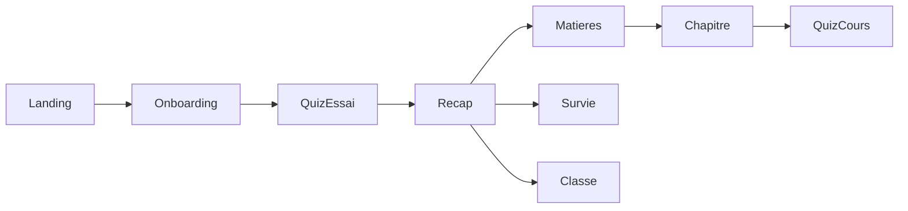

# Parcours cle 🎯

But: cartographier les parcours des joueurs/etudiants pour aligner contenu et UX.

## Parcours principaux

- Decouverte: arrivee via lien partage -> quiz d'essai -> inscription optionnelle -> matieres.
- Reprise cours: push notification "continue ton chapitre" -> page Matiere -> quiz suivant.
- Defi classe: invitation enseignant -> lobby Classe -> quiz classe -> podium.
- Survie detente: bouton rapide "Survie" -> run courte -> score partage.

## Diagramme de flux

## Heuristiques UX

- Chaque etape doit proposer 1 action primaire et 1 secondaire maxi.
- Toujours rappeler progression (chapitre en cours, badge en visee).
- Garder la latence percue < 500 ms entre etapes.

## Points d'attention

- Retour arriere doit restaurer l'etat (questions deja repondues).
- Afficher les gains (XP, badge, pass) juste apres un effort.
- Traduire tous les boutons clefs pour accessibilite.
